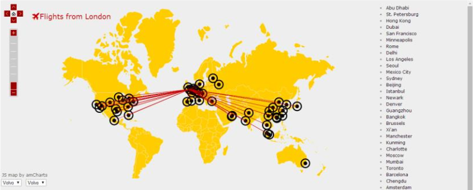
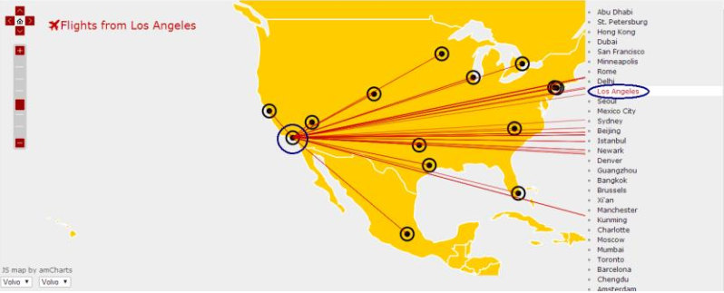

Python-Flight-Map
=================
A course project for INFO 155. 

This is a visualization program to show flights of some airports of users' choice and manage routes between two cities. 

Since the airports and flights all over the world are too much to be shown clearly on a map, the 50 airports with the most flights are chosen by default. Some properties of these airports are visualized including:

1. displaying all inward and outward flights of a city by clicking the point on the map or the name of the city;
2. various colors and styles of lines representing different types of plane and elapsed flight time.

The project also manages the routes by stopping over. It will take both time (including time of waiting) and price into account. If prices are unknown, it will be replaced by the duration of the flight, which is supposed to be positively related to the price.

## User Interface

All points are shown on the world map. Each point represents an airport.

The departure airport can be chosen by clicking the airport directly or find it in the list on the right. Then the map will show all the flights departuring from the airport. The chosen airport will be automatically moved to the center of the map.

At the bottom of the screen, there are two combo boxes to choose the place of departure and destination. System will manage the route accordingly which price and time displayed on the chart below. Move the slide block on the bar to show if the user has priority on price or efficiency, then press “search”. The system will provide different results according to users’ preference.

## Information Source

The information of all airlines in the world is published on the website www.openflights.org. 
The real-time data such as time and price can be found on the website www.qunar.com. 

## Installation

- Clone the project using `git clone https://github.com/zhangwengame/Python-Flight-Map.git`
- Install python3.4
- Install BeautifulSoup4 using `pip install BeautifulSoup4`
- Install wamp from: http://www.wampserver.com/en/
- Put the “Demo” folder to `wamp/www/` in the project
- Airports and flights have been generated to be displayed on the website. If you want to customize it:
  - Download the latest `airlines.dat`, `airports.dat` and `routes.dat` from http://openflights.org/data.html
  - Run `FindAirport.py` to generate new `nairport` and `nroute`
  - Use `PrintData.py` to convert those information into `data.js`
  - Put data.js to `Demo\ammap\`
- Use createData.py to get the latest flight information from http://www.qunar.com/. The information will be stored in `Demo\flight\flightData\`. This process may take half an hour to an hour.
- Run wamp. Open a browser and enter http://127.0.0.1/demo/flight/flightroutes.html, then you can use the user interface, and PLAY!
